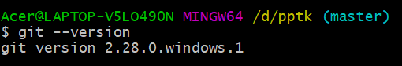
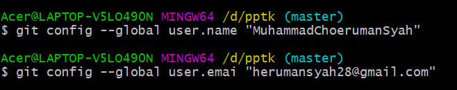

**NAMA : Muhammad Choeruman Syah**

**KELAS : TI.20.A.1**

**NIM : 312010031**

**TUGAS : Membuat repository**

# Langkah-Langkah Penggunaan Git

* Dwonload git terlebih dahulu, dengan link berikut : [click here](https://git-scm.com)

* setelah file terdownload, silahkan lakukan instalasi dengan referensi berikut ini : [Git installation guide](https://git-scm.com/book/en/v2/Getting-Started-Installing-Git)

* setelah installasi selesai, buka software GitBash pada menu di Windows, dan lakukan pengecekan versi, dengan mengetik syntax berikut :  

`git --version`  

* jika muncul tampilan git version,berarti Git sudah berhasil di install dan bisa di gunakan Langkah pertama kita harus mengkonfirmasikan user name dan email di git, dengan mengetikkan syntax berikut :  
`git commit --global user.name "masukkan nama anda"`  

`git commit --global user.email "masukkan email anda"`  

