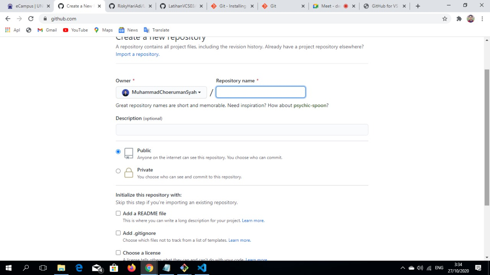

**NAMA : Muhammad Choeruman Syah**

**KELAS : TI.20.A.1**

**NIM : 312010031**

**TUGAS : Membuat repository**

# Langkah-Langkah Penggunaan Git

* Dwonload git terlebih dahulu, dengan link berikut : [click here](https://git-scm.com)

* setelah file terdownload, silahkan lakukan instalasi dengan referensi berikut ini : [Git installation guide](https://git-scm.com/book/en/v2/Getting-Started-Installing-Git)

* setelah installasi selesai, buka software GitBash pada menu di Windows, dan lakukan pengecekan versi, dengan mengetik syntax berikut :  

`git --version`  

* jika muncul tampilan git version,berarti Git sudah berhasil di install dan bisa di gunakan Langkah pertama kita harus mengkonfirmasikan user name dan email di git, dengan mengetikkan syntax berikut :  

> `git commit --global user.name "masukkan nama anda"`  

> `git commit --global user.email "masukkan email anda"`  

* Buat akun di **GitHub**, seperti contoh dibawah ini. Dan lakukan verifikasi akun melalui email yang sudah terdaftar.

* Jika akun **GitHub** sudah selesai dibuat dan di verifikasi, proses selanjutnya silahkan buat Repository seperti gambar dibawah ini :
**Penjelasan**

`Repository Name : (silahkan isi nama repository yang diinginkan seperti contoh saya ingin membuat repository Latihan VCS 03)`

`Description : (Isi dengan deskripsi atau penjelasan tentang repository Anda)`

`Public / Private : (PIlih salah satu jenis repository akan bisa dilihan sama semua orang atau tidak)`

`Add a README.md file : Centang pada bagian ini jika Anda menginginkan file README.md ada di repository Anda`

`Add .gitignore : Merupakan sebuah file yang berisi daftar nama-nama file dan direktori yang akan diabaikan oleh Git.`

`Choose a license : Silahkan centang jika Anda memiliki lisensi pada repository yang akan dibuat Kemudian tekan tombol Create Repository untuk menyimpan`

* Jika repository sudah dibuat maka akan muncul tampilan seperti dibawah ini :

