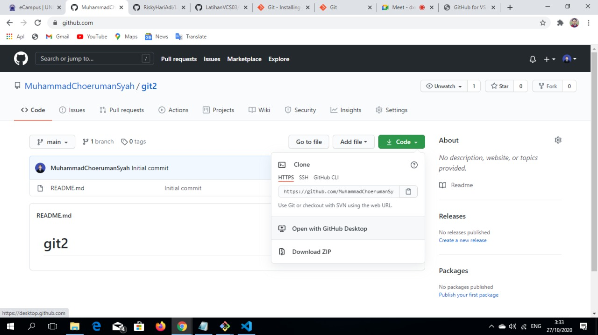
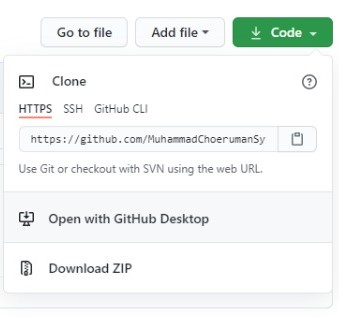
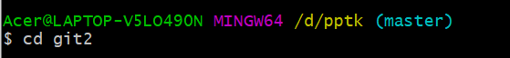
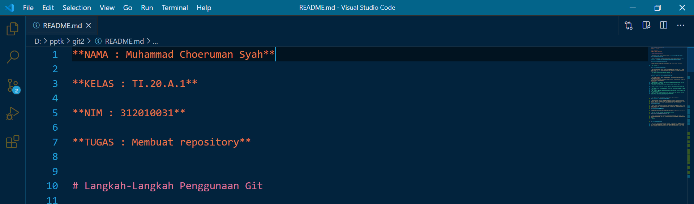
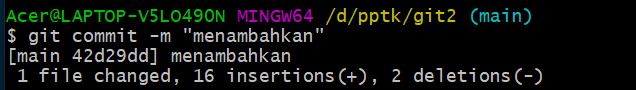
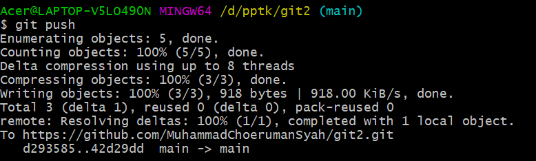
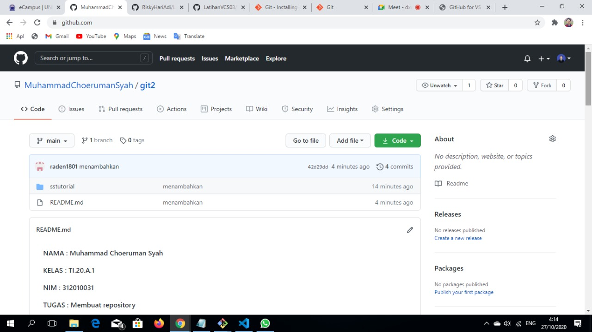

**NAMA : Muhammad Choeruman Syah**

**KELAS : TI.20.A.1**

**NIM : 312010031**

**TUGAS : Membuat repository**

# Langkah-Langkah Penggunaan Git

* Dwonload git terlebih dahulu, dengan link berikut : [click here](https://git-scm.com)

* setelah file terdownload, silahkan lakukan instalasi dengan referensi berikut ini : [Git installation guide](https://git-scm.com/book/en/v2/Getting-Started-Installing-Git)

* setelah installasi selesai, buka software GitBash pada menu di Windows, dan lakukan pengecekan versi, dengan mengetik syntax berikut :  

> `git --version`  

* jika muncul tampilan git version,berarti Git sudah berhasil di install dan bisa di gunakan Langkah pertama kita harus mengkonfirmasikan user name dan email di git, dengan mengetikkan syntax berikut :  

> `git commit --global user.name "masukkan nama anda"`  

> `git commit --global user.email "masukkan email anda"`  

* Buat akun di **GitHub**, seperti contoh dibawah ini. Dan lakukan verifikasi akun melalui email yang sudah terdaftar.

* Jika akun **GitHub** sudah selesai dibuat dan di verifikasi, proses selanjutnya silahkan buat Repository seperti gambar dibawah ini :
**Penjelasan**

> `Repository Name : (silahkan isi nama repository yang diinginkan seperti contoh saya ingin membuat repository Latihan VCS 03)`

> `Description : (Isi dengan deskripsi atau penjelasan tentang repository Anda)`

> `Public / Private : (PIlih salah satu jenis repository akan bisa dilihan sama semua orang atau tidak)`

> `Add a README.md file : Centang pada bagian ini jika Anda menginginkan file README.md ada di repository Anda`

> `Add .gitignore : Merupakan sebuah file yang berisi daftar nama-nama file dan direktori yang akan diabaikan oleh Git.`

> `Choose a license : Silahkan centang jika Anda memiliki lisensi pada repository yang akan dibuat Kemudian tekan tombol Create Repository untuk menyimpan`

* Jika repository sudah dibuat maka akan muncul tampilan seperti dibawah ini :

* Pembuatan akun dan repository pada GitHub telah selesai, saat ini akan kita lakukan untuk me-remote repository GitHub pada GitBash Lokal. Bagaimana caranya? Langkah pertama kita harus menyalin link URL git kita di GitHub, dengan cara tekan tombol Code lalu klik Copy:

* Setelah Link URL git kita tercopy, Silahkan buka File Explorer pada Windows, kemudian pilih folder dimana kita akan mendownload Repository dari GitHub ke lokal. Kemudian Klik Kanan, Pilih **Git Bash Here.**

* Pop Up Command Prompt (CMD) akan terbuka. Pada proses ini kita akan melakukan download file repository yang tadi dibuat, dengan mengetikkan syntax berikut :  

> `git clone [URL] pada contohnya, saya akan memasukan git clone`

https://github.com/MuhammadChoerumanSyah/git2.git

* Setelah proses cloning selesai, pada saat ini kita masih pada folder awal (master), kita harus masuk kedalam folder yang telah dicloning tadi yaitu LatihanVCS dengan mengetikkan syntax berikut :

> `cd git2`

* Saat ini kita sudah masuk kedalam folder LatihanVCS, Silahkan edit file README.md yang ada di File Explorer. Bisa menggunakan Text Editor (Sublime Text, Notepad, Notepad++, Visual Studio Code). Edit sesuai dengan keinginan. Aturan file .md (Markdown) bisa dilihat di Link berikut ini : [click here](https://guides.github.com/features/mastering-markdown/)

* Setelah file README.md diedit, silahkan Simpan file tersebut dengan cara **CTRL+S** atau **File** --> **Save**

* Langkah selanjutnya setelah file disimpan, kita kembali pada App Git Bash **(CMD)**. Ketik pada Git Bash seperti berikut ini :  

> `git add .`  

* Setelah selesai melakukan git add . langkah berikutnya kita akan melakukan commit. Fungsi commit adalah untuk menyimpan perubahan yang dilakukan, tetapi tidak ada perubahan pada remote repository. Ketik pada App Git Bash seperti berikut ini :  

> `git commit "Update README.md"`  

* Git commit telah selesai di lakukan. Untuk saat ini akan melakuka Git Push, Git Push berfungsi untuk mengirimkan perubahan file setelah di commit ke remote repository. Silahkan ketik pada App Git Bash seperti berikut :  

> `git push`  

  

* Semua proses telah selesai, silahkan kembali ke Web Browser untuk melihat perubahan yang telah di commit dan push dari remote.  

